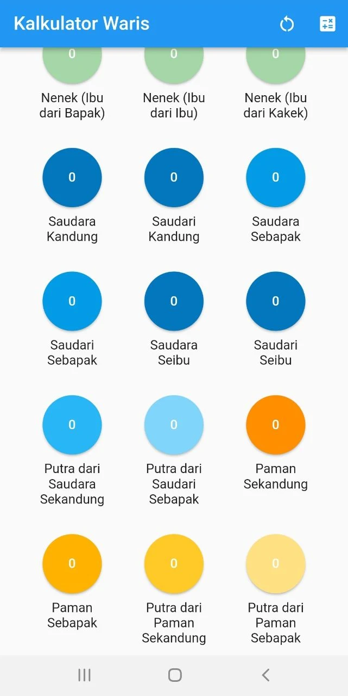

# Hifdzi Kalkulator Waris

_An experimental waris (inheritance) calculator_

## About this app

This application is experimental, limited to testing the results of learning the calculation of inheritance (faroid)

**Hifdzi Kalkulator Waris © 2023  - Hifdzi**

[Release History](../kalkulator/release_history_en.md)  
[Release Notes](../kalkulator/release_notes_en.md)  
[Privacy Policy](../kalkulator/privacy_policy.md)