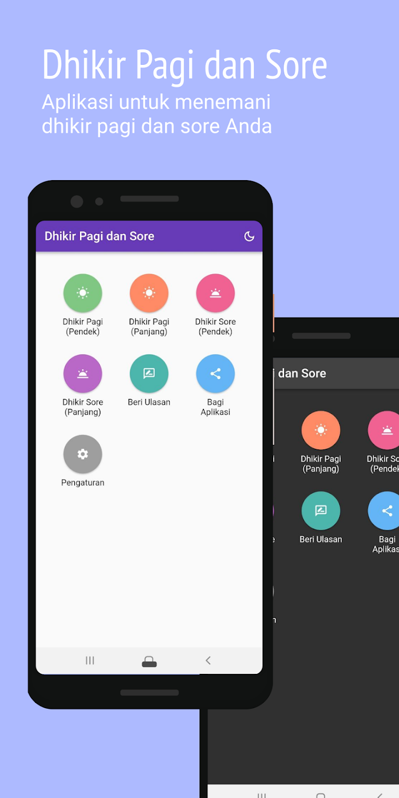
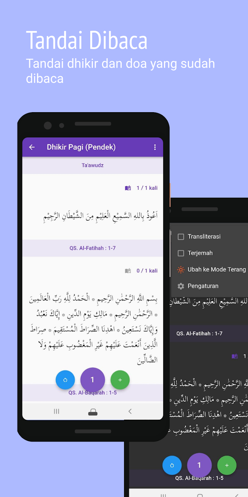
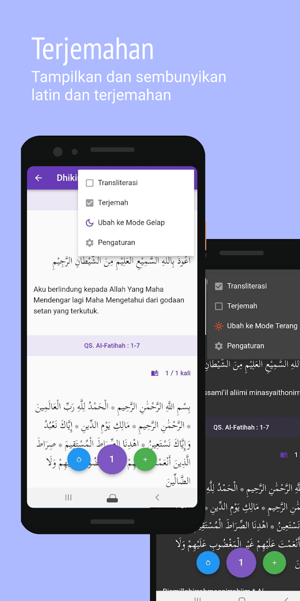
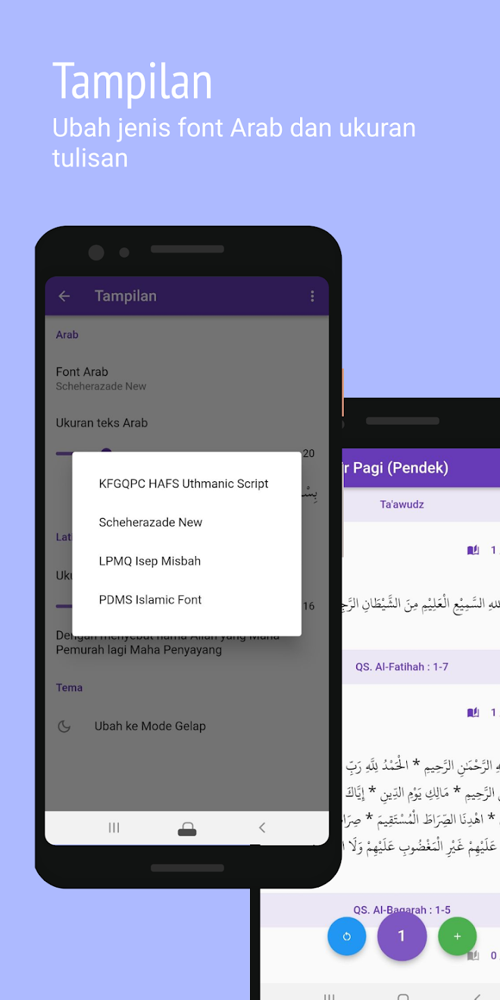

# Dhikir Pagi dan Sore

_A simple application to accompany your morning and evening dhikr (al-Ma’tsurat)_

## About this app

Currently available in Bahasa Indonesia only

Dhikir Pagi dan Sore is a simple application that helps simplify daily dhikr routine, especially morning and evening dhikr.

This application adopted the widely known dhikr/wird of Al-Ma'tsurat that are used also in many educational institutions.

Features:

1. Long and short dhikr versions, i.e. al-Ma'tsurat al-Kubro dan al-Ma'tsurat as-Sughro
2. Recitation marker helps remember number of dhikr recited
3. Bahasa Indonesia translation and transliteration

We hope this app could bring great benefit for you.

Expect more apps from us, and remember us in your best prayers. Blessings ;)

Dhikir Pagi dan Sore © 2023 - Hifdzi

[Release History](../pagisore/release_history_en.md)  
[Release Notes](../pagisore/release_notes_en.md)  
[Privacy Policy](../pagisore/privacy_policy.md)