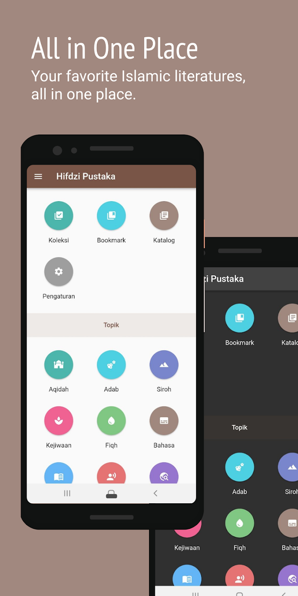
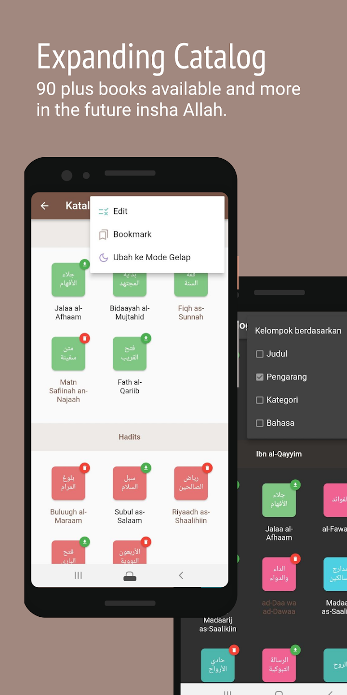
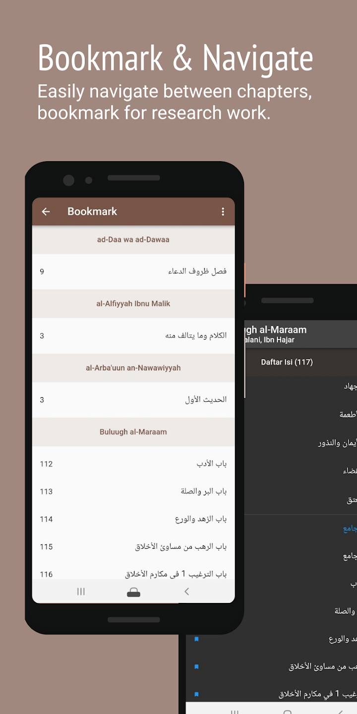
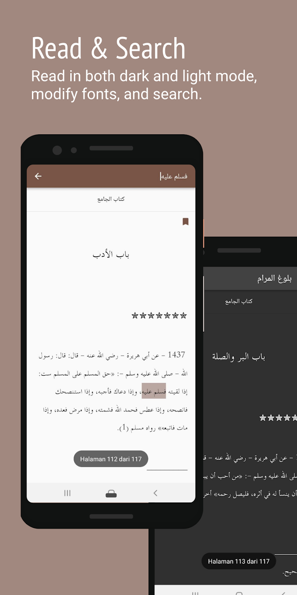

# Hifdzi Pustaka

_A simple application to simply read kitab (islamic literature)_

## About this app

Currently available in Bahasa Indonesia only

**Hifdzi Pustaka** is a simple application that helps students of knowledge search, collect, and read kitab (Islamic literature) of their choice.

**Hifdzi Pustaka** simplifies reading and referencing in a way that is flexible yet comprehensive.

Feature:

1. Kitab selection that can be downloaded and read offline
2. Bookmark pages from various kitab

Whether you use it to learn and study, to reference, or just to collect, we hope this app could bring great benefit for you.

Expect more apps from us, and remember us in your best prayers. May Allah bless us all 😉

**Hifdzi Pustaka © 2023  - Hifdzi**

[Release History](../pustaka/release_history_en.md)  
[Release Notes](../pustaka/release_notes_en.md)  
[Privacy Policy](../pustaka/privacy_policy.md)